# AWS Cloud Cards - Amazon Interactive Video Service
## Online Reference

This document is an online companion to the AWS Cloud Cards deck for Amazon Interactive Video Service (Amazon IVS). 

## Table of Contents

* [👋 Welcome To Cloud Cards!](#-welcome-to-cloud-cards)
* [🤘 IVS Rocks!](#-ivs-rocks)
* [⭐️ Live Streaming Made Easy](#-live-streaming-made-easy)
* [💪 Save It For Later (Low-Latency)](#-save-it-for-later--low-latency)
  + [Code](#code)
* [💪 Change The Channel](#-change-the-channel)
  + [Code](#code-1)
* [💪 Members Only](#-members-only)
  + [Code](#code-2)
* [💪 Flexible Ingest](#-flexible-ingest)
  + [Code](#code-3)
* [💪 Equal Access](#-equal-access)
  + [Code](#code-4)
* [💪 What Time Is It?](#-what-time-is-it)
  + [Code](#code-5)
* [💪 No Pirates!](#-no-pirates)
  + [Code](#code-6)
* [💪 No Interruptions](#-no-interruptions)
* [⭐️ Welcome To The Stage!](#-welcome-to-the-stage)
  + [Code](#code-7)
* [💪 Extended Reach (Part 1)](#-extended-reach--part-1)
* [💪 Extended Reach (Part 2)](#-extended-reach--part-2)
  + [Code](#code-8)
* [💪 Save It For Later (Real-Time)](#-save-it-for-later--real-time)
  + [Code](#code-9)
* [💪 WHIP It Up!](#-whip-it-up)
* [💪 Perfect Timing](#-perfect-timing)
  + [Code](#code-10)
* [💪 Alternative Ingest](#-alternative-ingest)
  + [Code](#code-11)
* [💪 Real Time, Real Quality](#-real-time--real-quality)
  + [Code](#code-12)
* [⭐️ Hey Chat!](#-hey-chat)
  + [Code](#code-13)
* [💪 Watch What You Say!](#-watch-what-you-say)
  + [Code](#code-14)
* [💪 Remember What They Said](#-remember-what-they-said)
  + [Code](#code-15)
* [☁️ Amazon CloudWatch](#-amazon-cloudwatch)
* [☁️ Amazon EventBridge](#-amazon-eventbridge)
  + [Code](#code-16)
* [☁️ AWS CloudTrail](#-aws-cloudtrail)
* [☁️ Amazon S3](#-amazon-s3)
* [☁️ AWS AppSync](#-aws-appsync)
  + [Code](#code-17)
* [🧑🏽‍💻 Watch Anywhere](#----watch-anywhere)
  + [Code](#code-18)
* [🧑🏽‍💻 Streaming On The Go](#----streaming-on-the-go)
  + [Code](#code-19)
* [💡 Let Them Cook](#-let-them-cook)
* [💡 Place Your Bets](#-place-your-bets)
* [💡 Learning Time](#-learning-time)
* [💡 Can You Hear Me?](#-can-you-hear-me)
  + [Code](#code-20)
* [💡 Shop Until You Drop](#-shop-until-you-drop)
  + [Code](#code-21)
* [💡 Social Streaming](#-social-streaming)

## 👋 Welcome To Cloud Cards!


## 🤘 IVS Rocks!


## ⭐️ Live Streaming Made Easy

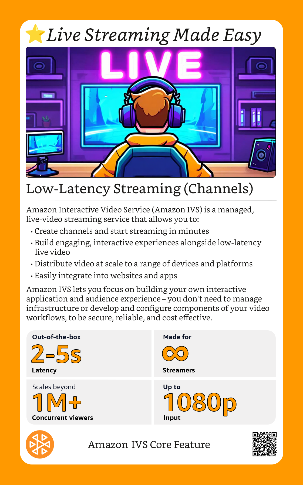
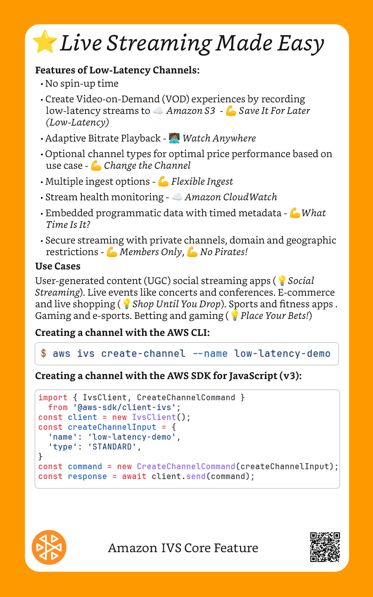

Code Samples

```bash
$ aws ivs create-channel --name low-latency-demo
```

```javascript
import { IvsClient, CreateChannelCommand } 
  from '@aws-sdk/client-ivs';
const client = new IvsClient();
const createChannelInput = {
  'name': 'low-latency-demo',
  'type': 'STANDARD',
}
const command = new CreateChannelCommand(createChannelInput);
const response = await client.send(command);
```

## 💪 Save It For Later (Low-Latency)


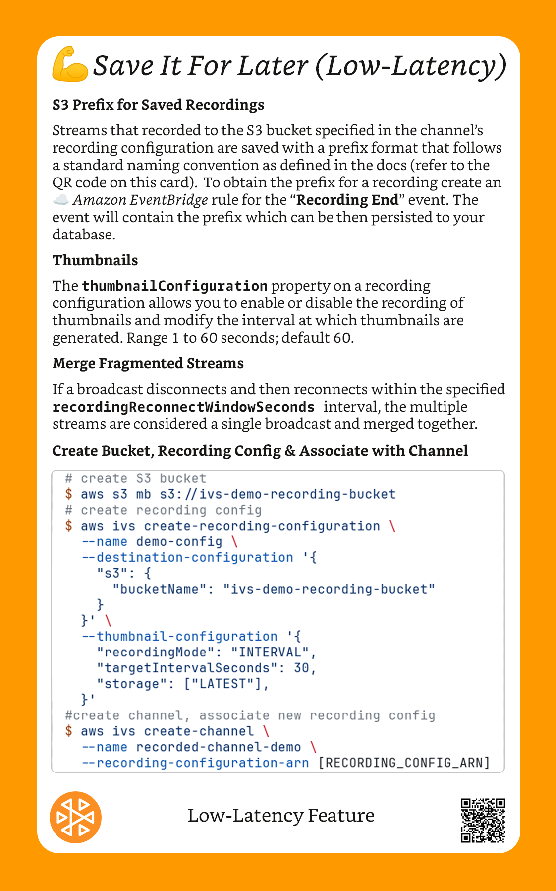

### Code

```bash
# create S3 bucket
$ aws s3 mb s3://ivs-demo-recording-bucket
# create recording config
$ aws ivs create-recording-configuration \
  --name demo-config \
  --destination-configuration '{
    "s3": {
      "bucketName": "ivs-demo-recording-bucket"
    }
  }' \
  --thumbnail-configuration '{
    "recordingMode": "INTERVAL",
    "targetIntervalSeconds": 30,
    "storage": ["LATEST"],
  }'
#create channel, associate new recording config
$ aws ivs create-channel \
  --name recorded-channel-demo \
  --recording-configuration-arn [RECORDING_CONFIG_ARN]
```
## 💪 Change The Channel


### Code

```bash
$ aws ivs create-channel \
  --name low-latency-demo \
  --type STANDARD
```

## 💪 Members Only


### Code

```bash
$ openssl ecparam -name secp384r1 -genkey -noout -out priv.pem
$ openssl ec -in priv.pem -pubout -out public.pem
```

```bash
$ aws ivs import-playback-key-pair \
  --public-key-material "`cat public.pem`"
```

```bash
$ aws ivs create-channel --authorized
```

## 💪 Flexible Ingest


### Code

```bash 
$ ffmpeg -re -stream_loop -1 \
  -i $VIDEO_FILEPATH -r 30 \
  -c:v libx264 -pix_fmt yuv420p \
  -profile:v main -preset veryfast \
  -x264opts "nal-hrd=cbr:no-scenecut" \
  -minrate 3000 -maxrate 3000 -g 60 \
  -c:a aac -b:a 160k -ac 2 -ar 44100 \
  -f flv rtmps://$INGEST_ENDPOINT:443/app/$STREAM_KEY
```

```bash
$ export URI="srt://$INGEST_ENDPOINT:9000"
$ URI="$URI?streamid=$STREAM_KEY"
$ URI="$URI&passphrase=$PASSPHRASE"
$ ffmpeg -re -i $VIDEO_FILEPATH -c copy -f mpegts $URI
```

## 💪 Equal Access


### Code

```bash
$ git clone https://github.com/aws-samples/\
amazon-ivs-webgpu-captions-demo.git

# initialize the infrastructure
$ npm run deploy:init

# deploy the backend stack
$ npm run deploy:backend

# run the client app
$ npm ci
$ npm run dev

# deploy the client app (optional)
$ npm run deploy:website
```

## 💪 What Time Is It?


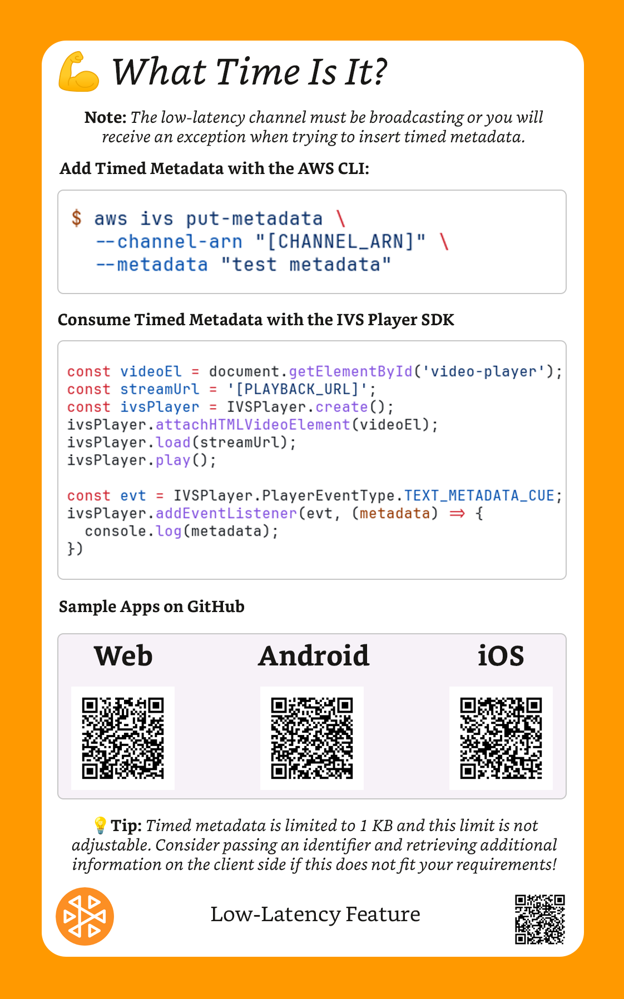

### Code

```bash
$ aws ivs put-metadata \
  --channel-arn "[CHANNEL_ARN]" \
  --metadata "test metadata"
```

```javascript
const videoEl = document.getElementById('video-player');
const streamUrl = '[PLAYBACK_URL]';
const ivsPlayer = IVSPlayer.create();
ivsPlayer.attachHTMLVideoElement(videoEl);
ivsPlayer.load(streamUrl);
ivsPlayer.play();

const evt = IVSPlayer.PlayerEventType.TEXT_METADATA_CUE;
ivsPlayer.addEventListener(evt, (metadata) => {
  console.log(metadata);
})
```

## 💪 No Pirates!


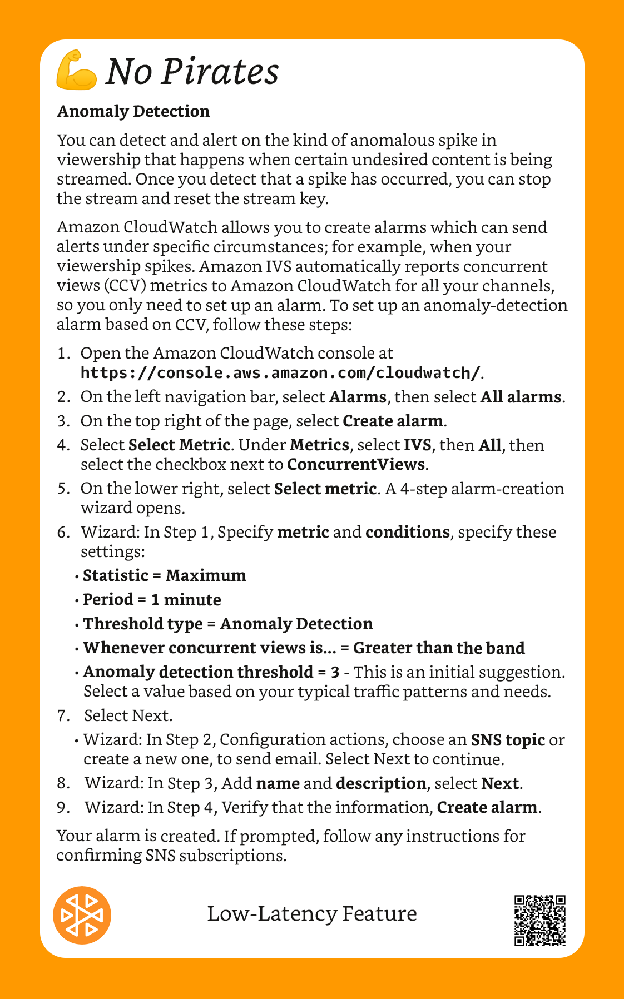

### Code

```bash
$ aws ivs create-playback-restriction-policy \
  --name demo-policy \
  --enable-strict-origin-enforcement \
  --allowed-countries "US", "JP" \
  --allowed-origins "https://example.com"
# add policy to channel
$ aws ivs update-channel \
  --arn [CHANNEL_ARN] \
  --playback-restriction-policy-arn [POLICY_ARN]
```

## 💪 No Interruptions


## ⭐️ Welcome To The Stage!

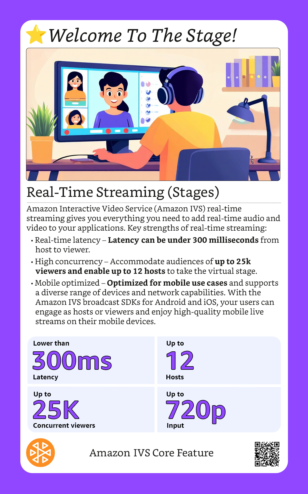


### Code

```bash
$ aws ivs-realtime create-stage --name real-time-demo
```

```bash
$ aws ivs-realtime create-stage --name real-time-demo \
  --participant-token-configurations '[{"userId": "1"}]'
```

```javascript
import { IvsRealTimeClient, CreateStageCommand } 
  from "@aws-sdk-client-ivs-realtime";

const client = new IvsRealTimeClient();
const input = {
  name: 'real-time-demo',
  participantTokenConfigurations: [
    {
      userId: "1",
    }
  ]
};
const command = new CreateStageCommand(input);
const response = await client.send(command);
```

## 💪 Extended Reach (Part 1)

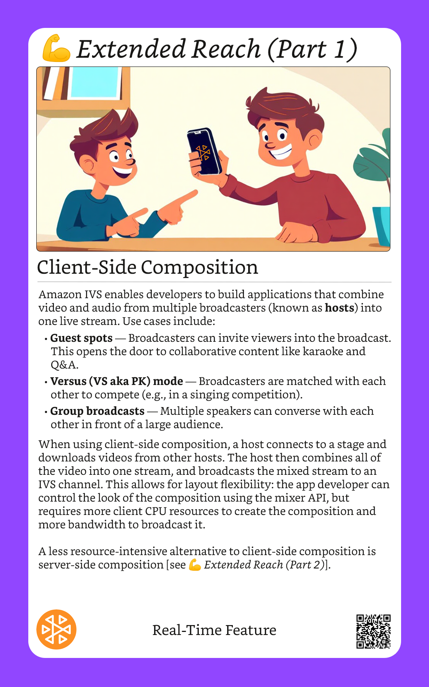


## 💪 Extended Reach (Part 2)


### Code

```bash
$ aws ivs-realtime create-encoder-configuration \
  --name demo-encoder-configuration \
  --video "bitrate=25000000,height=720,width=1280,framerate=30"
```

```bash
$ aws ivs-realtime start-composition \
  --stage-arn [REAL_TIME_STAGE_ARN] \
  --destination '[
    {
      "channel": {
        "channelArn": "[LOW_LATENCY_CHANNEL_ARN]",
        "encoderConfigurationArn": "[ENCODER_CONFIG_ARN]"
      }
    }
  ]'
```

## 💪 Save It For Later (Real-Time)


### Code

```bash
$ aws ivs-realtime create-storage-configuration \
  --name demo-storage-config \
  --s3 "bucket=demo-recording-bucket"
```

```bash
$ aws ivs-realtime create-encoder-configuration \
  --name demo-encoder-configuration \
  --video "bitrate=6000000,height=1080,width=1920,framerate=60"
```

```bash
$ aws ivs-realtime start-composition \
  --stage-arn "[STAGE_ARN]" \
  --destination '[{
    "s3": {
      "encoderConfigurationArn": ["[ENCODER_CONFIG_ARN]"],
      "storageConfigurationArn": "[STORAGE_CONFIG_ARN]"
    }
  }]
  '
```
## 💪 WHIP It Up!


## 💪 Perfect Timing


### Code

```javascript
const config = {
  inBandMessaging: { enabled: true }
};
const stream = new LocalStageStream(videoTrack, config);
const payload = new TextEncoder().encode('test').buffer;
stream.insertSeiMessage(payload);
```

```javascript
const strategy = {
    subscribeConfiguration: (participant) => {
        return { inBandMessaging: { enabled: true } };
    }
    // ... other strategy functions
}
stage.on(StageEvents.STAGE_STREAM_SEI_MESSAGE_RECEIVED, 
  (participant, seiMessage) => {
    console.log(seiMessage.payload, seiMessage.uuid);
});
```

```javascript
{"timestamp":"...","event":"card_dealt","seat":2,"card":"7H","face_up":true}
{"timestamp":"...","event":"card_dealt","seat":4,"card":"6S","face_up":true}
{"timestamp":"...","event":"card_dealt","card":"3S","face_up":true}
{"timestamp":"...","event":"card_dealt","seat":2,"card":"5H","face_up":true}
{"timestamp":"...","event":"card_dealt","seat":4,"card":"10H","face_up":true}
{"timestamp":"...","event":"card_dealt","card":"4S","face_up":false}
{"timestamp":"...","event":"prompt_player","seat":4}
{"timestamp":"...","event":"player_action","seat":4,"action":"hit"}
{"timestamp":"...","event":"card_dealt","seat":4,"card":"4S","face_up":false}
{"timestamp":"...","event":"prompt_player","seat":4}
{"timestamp":"...","event":"player_action","seat":4,"action":"stand"}
{"timestamp":"...","event":"prompt_player","seat":2}
{"timestamp":"...","event":"player_action","seat":2,"action":"hit"}
{"timestamp":"...","event":"card_dealt","seat":2,"card":"JS","face_up":false}
{"timestamp":"...","event":"prompt_player","seat":2}
{"timestamp":"...","event":"player_action","seat":2,"action":"stay"}
{"timestamp":"...","event":"dealer_reveal","card":"4S"}
```

## 💪 Alternative Ingest


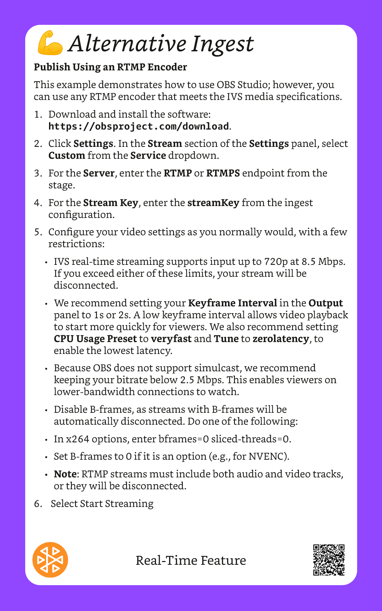

### Code

```bash
$ aws ivs-realtime create-ingest-configuration \
  --name demo-ingest-config \
  --stage-arn "[STAGE_ARN]" \
  --ingest-protocol RTMPS
```

## 💪 Real Time, Real Quality


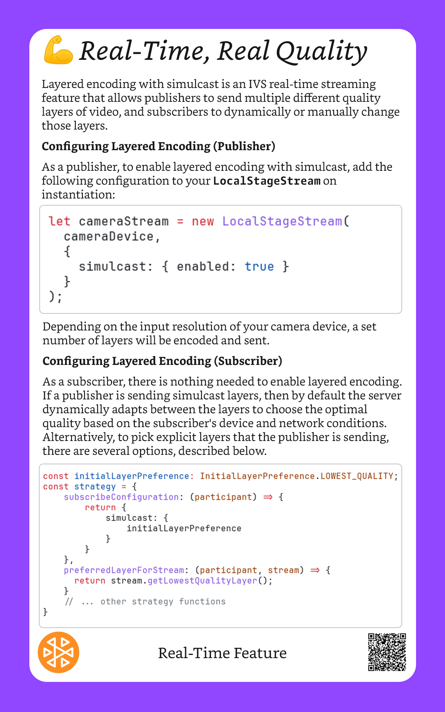

### Code

```javascript
let cameraStream = new LocalStageStream(
  cameraDevice,
  {
    simulcast: { enabled: true }
  }
);
```

```javascript
const initialLayerPreference: InitialLayerPreference.LOWEST_QUALITY;
const strategy = {
    subscribeConfiguration: (participant) => {
        return {
            simulcast: {
                initialLayerPreference
            }
        }
    },
    preferredLayerForStream: (participant, stream) => {
      return stream.getLowestQualityLayer();
    }
    // ... other strategy functions
}
```

## ⭐️ Hey Chat!


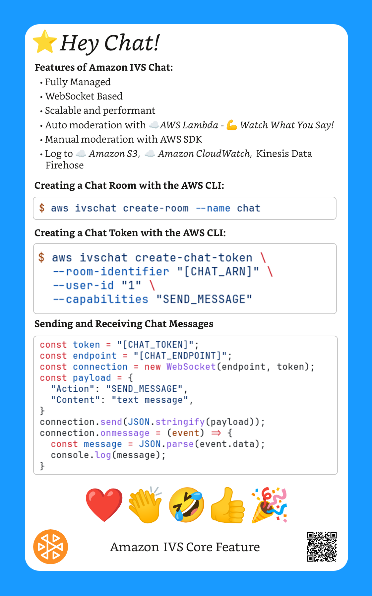

### Code

```bash
$ aws ivschat create-room --name chat
```

```bash
$ aws ivschat create-chat-token \
  --room-identifier "[CHAT_ARN]" \
  --user-id "1" \
  --capabilities "SEND_MESSAGE"
```

```javascript
const token = "[CHAT_TOKEN]";
const endpoint = "[CHAT_ENDPOINT]";
const connection = new WebSocket(endpoint, token);
const payload = {
  "Action": "SEND_MESSAGE",
  "Content": "text message",
}
connection.send(JSON.stringify(payload));
connection.onmessage = (event) => {
  const message = JSON.parse(event.data);
  console.log(message);
}
```

## 💪 Watch What You Say!


### Code

```javascript
{
   "Content": "string",
   "MessageId": "string",
   "RoomArn": "string",
   "Attributes": {"string": "string"},
   "Sender": {
      "Attributes": { "string": "string" },
      "UserId": "string",
      "Ip": "string"
   }
}
```

```javascript
{
   "Content": "string",
   "ReviewResult": "string",
   "Attributes": {"string": "string"},
}
```

```javascript
"Attributes": { "Reason": "denied for moderation" }
```

```bash
$ aws ivschat create-room \
  --name demo-chat \
  --message-review-handler '
    {
      "fallbackResult": "DENY",
      "uri": "[LAMBDA_ARN]",
    }
  '
```

## 💪 Remember What They Said


### Code

```bash
$ aws logs create-log-group --log-group-name demo-chat-cw-logs
$ aws ivschat create-logging-configuration \
  --name demo-chat-log  \
  --destination-configuration '
    {
      "cloudWatchLogs": {
        "logGroupName" : "demo-chat-cw-logs"
      }
    }
  '
$ aws ivschat create-room \
  --name demo-chat  \
  --logging-configuration-identifiers "[LOGGING_CONFIG_ARN]"
```

```bash
$ aws s3 mb s3://demo-chat-s3-logs
$ aws ivschat create-logging-configuration \
  --name demo-chat-log  \
  --destination-configuration '
    {
      "s3": {
        "bucketName" : "demo-chat-s3-logs"
      }
    }
  '
```

```bash
# create firehose delivery stream first...
$ aws ivschat create-logging-configuration \
  --name demo-chat-log  \
  --destination-configuration '
    {
      "firehose": {
        "deliveryStreamName" : "demo-chat-firehose-stream"
      }
    }
  '
```
## ☁️ Amazon CloudWatch


## ☁️ Amazon EventBridge


### Code

```javascript
export const handler = async (event) => {
  console.log(`
    Received: '${event["detail-type"]}'
    named '${event.detail.event_name}'
    at ${event.time}
    on channel ${event.detail.channel_name}
    with stream id ${event.detail.stream_id}.
  `);
}
```

```bash
# create rule
$ aws events put-rule  \
  --name demo-ivs-event \
  --event-pattern "{\"source\": [\"aws.ivs\"]}" \
  --state ENABLED
# add permission to invoke lambda
$ aws lambda add-permission \
  --function-name ivs-demo-function \
  --statement-id EventBridgeInvoke \
  --action lambda:InvokeFunction \
  --principal events.amazonaws.com \
  --source-arn [RULE_ARN]
# add lambda function as target for rule
$ aws events put-targets --rule demo-ivs-rule \
  --targets '{"Id": "1", "Arn": "[LAMBDA_ARN]"}'
```

## ☁️ AWS CloudTrail


## ☁️ Amazon S3


## ☁️ AWS AppSync


### Code

```bash
$ aws appsync create-api \
  --name demo-event-api \
  --event-config '
    {
      "authProviders": [{"authType": "API_KEY"}],
      "connectionAuthModes": [{"authType": "API_KEY"}],
      "defaultPublishAuthModes": [{"authType": "API_KEY"}],
      "defaultSubscribeAuthModes": [{"authType": "API_KEY"}]
    }'
$ aws appsync create-api-key --api-id [API_ID]
$ aws appsync create-channel-namespace \
  --name default-api-ns \
  --api-id [API_ID]
```

## 🧑🏽‍💻 Watch Anywhere


### Code

```javascript
const videoEl = document.getElementById('video-player');
const streamUrl = '[PLAYBACK_URL]';
const ivsPlayer = IVSPlayer.create();
ivsPlayer.attachHTMLVideoElement(videoEl);
ivsPlayer.load(streamUrl);
ivsPlayer.play();
```

## 🧑🏽‍💻 Streaming On The Go


### Code

```html
<canvas id="preview"></canvas>

<script type="module">
  const streamKey = '[STREAM_KEY]';
  const ingestEndpoint = '[INGEST_ENDPOINT]';
  const streamConfig = IVSBroadcastClient.STANDARD_LANDSCAPE;
  const config = { streamConfig, ingestEndpoint };
  const client = IVSBroadcastClient.create(config);
  await navigator.mediaDevices.getUserMedia({ video: true, audio: true });
  client.attachPreview(document.getElementById('preview'));
  const devices = await navigator.mediaDevices.enumerateDevices();
  const videoDevices = devices.filter(d => d.kind == 'videoinput');
  const audioDevices = devices.filter(d => d.kind == 'audioinput');
  const cameraStream = 
    await navigator.mediaDevices.getUserMedia({
      video: { 
        deviceId: videoDevices[0].deviceId,
        aspectRatio: 16 / 9,
      },
    });
  const microphoneStream = 
    await navigator.mediaDevices.getUserMedia({
      audio: { 
        deviceId: audioDevices[0].deviceId 
      },
    });
  client.addVideoInputDevice(cameraStream, 'camera1', { index: 0 });
  client.addAudioInputDevice(microphoneStream, 'mic1');
  client.startBroadcast(streamKey)
</script>
```
## 💡 Let Them Cook


## 💡 Place Your Bets


## 💡 Learning Time

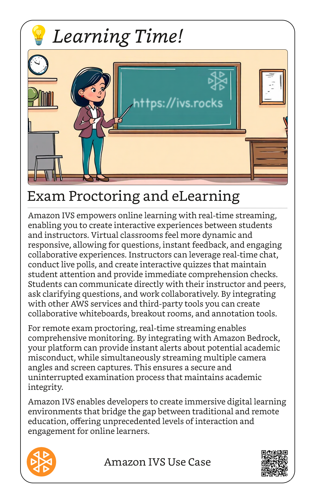
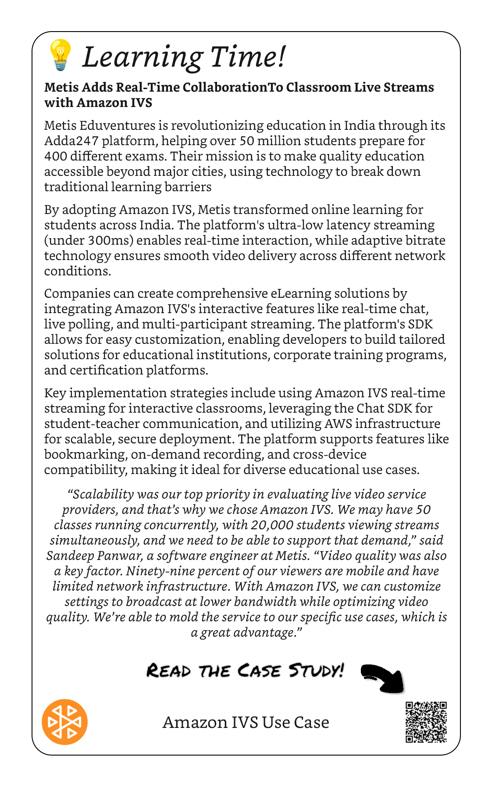

## 💡 Can You Hear Me?


### Code

```bash
$ git clone \
  https://github.com/aws-samples/amazon-ivs-real-time-audio-rooms-web-demo.git
$ cd amazon-ivs-real-time-audio-rooms-web-demo
```

```bash
$ npm run deploy:init
```

```bash
$ npm run deploy:backend:dev # for development
$ npm run deploy:backend:prod # for production
```

```bash
$ npm run deploy:website:dev # for development
$ npm run deploy:website:prod # for production
```

```bash
$ npm run dev
```

## 💡 Shop Until You Drop


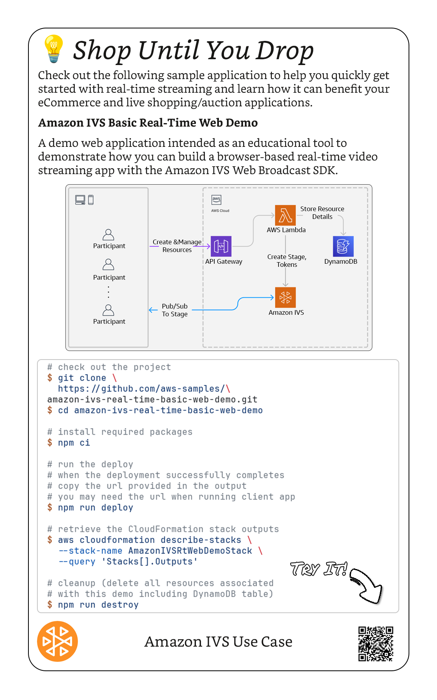

### Code

```bash
# check out the project
$ git clone \
  https://github.com/aws-samples/\
amazon-ivs-real-time-basic-web-demo.git
$ cd amazon-ivs-real-time-basic-web-demo

# install required packages
$ npm ci

# run the deploy
# when the deployment successfully completes
# copy the url provided in the output
# you may need the url when running client app
$ npm run deploy

# retrieve the CloudFormation stack outputs
$ aws cloudformation describe-stacks \
  --stack-name AmazonIVSRtWebDemoStack \
  --query 'Stacks[].Outputs'

# cleanup (delete all resources associated 
# with this demo including DynamoDB table)
$ npm run destroy
```

## 💡 Social Streaming


